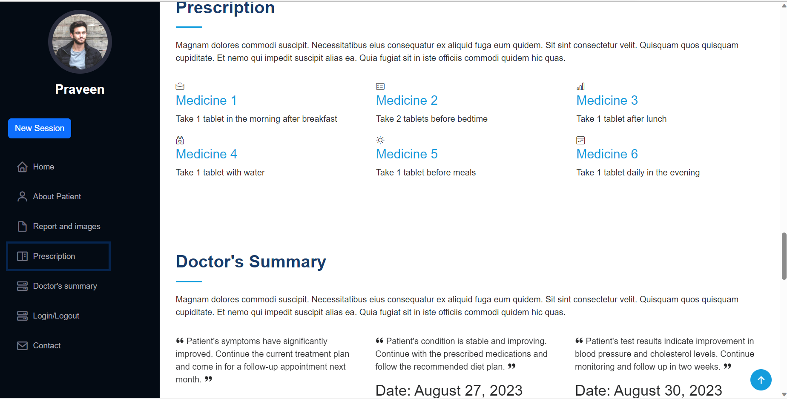
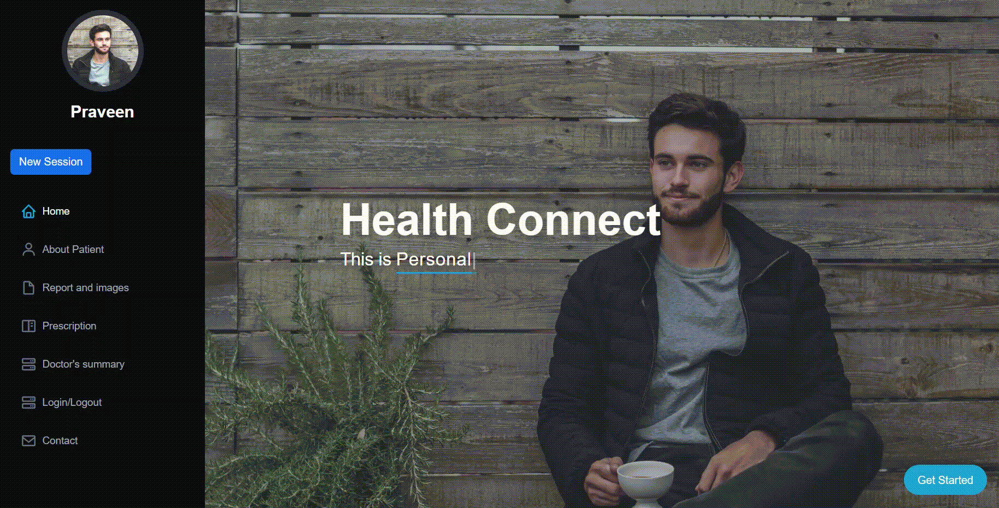
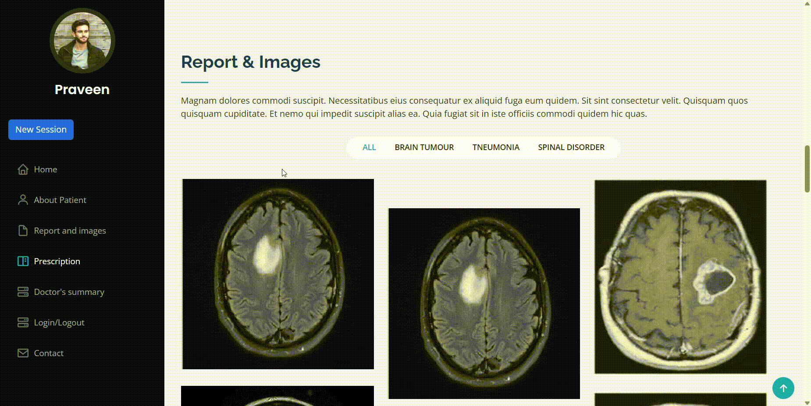

# The Healthcare Management System Using AI ( HEALTH CONNECT )

### This project is developed by the team 'Model Magicians' during the 48-Hour Offline Hackathon at the 'Dhirubhai Ambani Institute of Information and Communication Technology (DAIICT), Gandhinagar,' held from August 25th to 27th, 2023.

## Team Name: Model Magicians
- Team Members:
    * Yatrik Shah
    * Naqibahmed Kadri
    * Keya Shah
    * Zeel Rathi
- Contact Email:
    * yatriks7@gmail.com
    * naqib.kadri.50@gmail.com
    * keyashah9009@gmail.com
    * zeelrathi807@gmail.com

## Project Overview 🚀
The project aims to streamline medical record management and enhance doctor-patient interactions using OCR, image analysis, and classification. It involves converting medical records into searchable PDFs, analyzing medical images, facilitating symptom-based document retrieval, transcribing and summarizing conversations, and generating prescription QR codes.

## Tech Stack 💻

Here are the technologies and tools we used to build our AI solution:

* **HTML** 
* **CSS** 
* **Python** 
* **TensorFlow** 
* **PyTorch** 
* **Pandas** 
* **OpenCV**
*  **Librosa**
*  **NLTK**
*  **Transformers**
* **Pytorch**
* [More technologies/tools used]

## Project Features and Functionality ✨
- OCR Conversion: Convert medical records PDFs into searchable PDFs using Optical Character Recognition (OCR) technology.
- Image Analysis and Classification: Analyze medical images to classify conditions such as fractures and cancer using image analysis and classification techniques.
- Symptom-based Document Retrieval: Nurses use patient symptoms as keywords to search for relevant OCR'd documents, aiding doctors in diagnosis.
- Doctor's Interface: Present OCR'd records and image analysis results to doctors for informed decision-making during patient consultations.
- Transcription and Summarization: Utilize Large Language Models (LLMs) to transcribe and summarize doctor-patient conversations, facilitating efficient review.
- QR Code Prescription: Generate QR codes for prescribed medications, enabling easy scanning at pharmacies for medication fulfillment.

## How It Works 🛠️
Provide a high-level overview of how our AI solution works. You can use diagrams or flowcharts to make it easier to understand. Explain the key components, data flow, and the AI/ML techniques utilized.

## Challenges and Solutions 🧠
* Audio Separation and Deep Clustering: Initially, the project aimed to separate doctor-patient audio using spectrogram and deep clustering methods. However, due to complexity and resource limitations, implementing this in-house proved challenging.

Solution: As an alternative, an external API specializing in audio separation was integrated to achieve accurate separation of doctor-patient conversations.

## Future Enhancements 🚧
* Blockchain Integration: Enhance data security and integrity by incorporating blockchain technology to create an immutable and tamper-proof audit trail for medical records.
* Real-time Collaboration: Enable real-time collaboration between doctors, nurses, and patients by integrating chat and video features into the platform.
* Predictive Analytics: Implement predictive analytics to assist doctors in making proactive treatment recommendations based on historical patient data.
* Integration with EHR Systems: Integrate with Electronic Health Record (EHR) systems to streamline data sharing and improve the overall healthcare ecosystem.

## Screenshots and Demos 📸
Showcase the visual aspects of our AI solution through screenshots or videos. If possible, include a link to a live demo or video demonstration.

## Acknowledgments 🙌

We would like to **thank** our team members, **Naqibahmed Kadri**, **Yatrik Shah**, **Keya Shah**, and **Zeel**, for their **hard work** and **dedication**. We would also like to **thank** the **Organisation Dhirubhai Ambani Institute of Information and Communication Technology (DA-IICT)** for organizing and hosting the event at their **campus**. Their **support** and **encouragement** were **essential** to our **success**.

## Get In Touch! 📬

| Team Member | LinkedIn | Kaggle | Email |
|---|---|---|---|
| Naqibahmed Kadri |  |  | [naqibahmedkadri@gmail.com](mailto:naqibahmedkadri@gmail.com) |
| Yatrik Shah |  |  | [yatriks7@gmail.com](mailto:yatriks7@gmail.com) |
| Keya Shah |  |  | [keyashah9009@gmail.com](mailto:keyashah9009@gmail.com) |
| Zeel Rathi |  |  | [zeelrathi807@gmail.com](mailto:zeelrathi807@gmail.com) |

---

